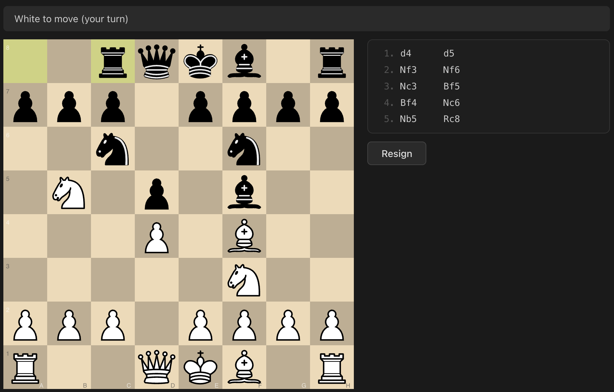

# nwave-chess

A self-learning chess engine written in Rust with a Svelte 5 web frontend. The engine uses TD-Leaf(lambda) with hand-crafted evaluation features to improve from every game it plays.



## Prerequisites

- **Rust** 1.85+ (install via [rustup](https://rustup.rs/))
- **Node.js** 20+ (install via [nvm](https://github.com/nvm-sh/nvm) or [nodejs.org](https://nodejs.org/))

## Quick start

Build the frontend and start the server:

```bash
cd frontend && npm install && npm run build && cd ..
cargo run
```

Open http://localhost:3000 in your browser.

## Command-line options

```
--port <PORT>              Port to listen on [default: 3000]
--db-path <DB_PATH>        Path to SQLite database [default: data/nwave-chess.db]
--search-depth <DEPTH>     Maximum search depth [default: 6]
--search-log               Log search details (candidates, PV, eval) to the terminal
--frontend-dir <DIR>       Path to frontend static files [default: ../frontend/dist]
```

Example with search logging:

```bash
cargo run -- --search-log --search-depth 4
```

## Project structure

```
nwave-chess/
  backend/
    src/
      engine/       # Board, search, evaluation, transposition table
      learning/     # TD-Leaf, self-play, optimizer, weight management
      server/       # WebSocket server, protocol, game session
      data/         # SQLite schema, persistence
  frontend/
    src/
      lib/
        chess/      # Board utilities (Chessground helpers)
        components/ # Svelte components (board, panels, screens)
        state/      # Reactive state (game, search, learning, connection)
        ws/         # WebSocket client and protocol types
```

## How it works

**Playing.** Choose white or black from the main screen. The engine responds to your moves with alpha-beta search at the configured depth, streaming its thinking process to the UI in real time.

**Learning.** After each game, the engine runs TD-Leaf(lambda) to compare its position evaluations against what deeper search later revealed. The TD errors drive gradient descent updates (Adam optimizer) across ~470 evaluation weights covering piece values, piece-square tables, and game phase interpolation. Weights persist in SQLite across sessions.

**Self-play.** From the main screen, enter self-play mode to have the engine play against itself. Games use randomized openings (8 random half-moves) for variety. A live chessboard displays each game as it unfolds. The engine learns from every self-play game the same way it learns from human games.

## Running tests

```bash
cargo test
```

Frontend type checking:

```bash
cd frontend && npm run check
```

## License

MIT
