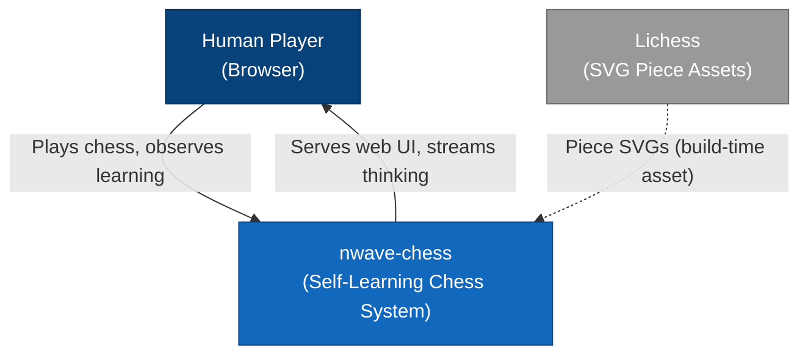
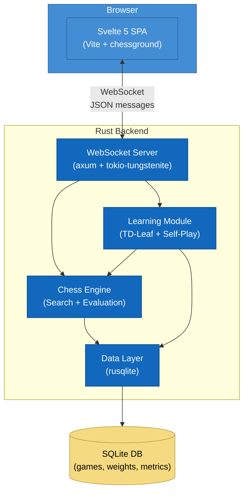
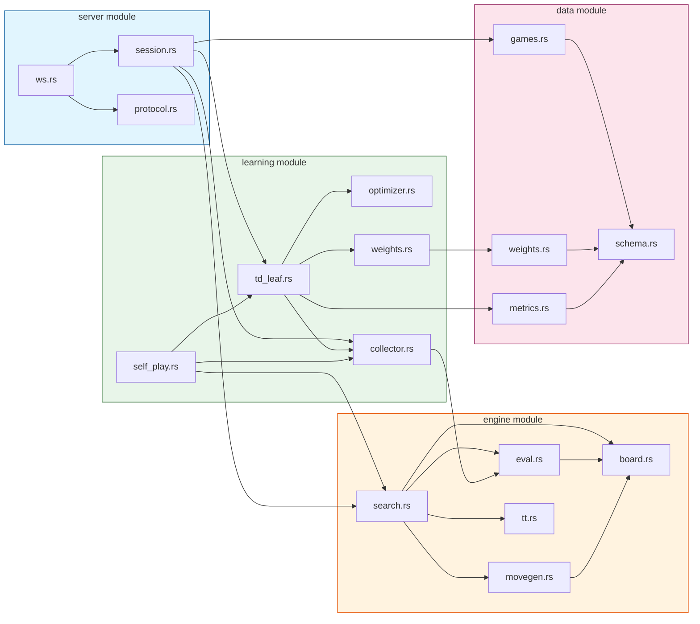

# nwave-chess: Architecture Design Document

**Date:** 2026-02-20
**Status:** Draft
**Author:** Morgan (Solution Architect)

---

## Table of Contents

1. [System Overview](#1-system-overview)
2. [C4 Diagrams](#2-c4-diagrams)
3. [Backend Architecture (Rust)](#3-backend-architecture-rust)
4. [Frontend Architecture (Svelte 5)](#4-frontend-architecture-svelte-5)
5. [WebSocket Message Protocol](#5-websocket-message-protocol)
6. [Data Layer (SQLite)](#6-data-layer-sqlite)
7. [Rust Crate Recommendations](#7-rust-crate-recommendations)
8. [Project Structure](#8-project-structure)
9. [Component Dependency Diagram](#9-component-dependency-diagram)
10. [Architecture Decision Records](#10-architecture-decision-records)

---

## 1. System Overview

nwave-chess is a self-learning chess program where a human plays against an engine via a web UI. The engine uses TD-Leaf(lambda) with hand-crafted evaluation features to learn from each game, improving over time. The backend streams its thinking process in real-time so the user can observe the engine's reasoning.

### Key Capabilities

- Human plays white or black against the engine via browser
- Engine searches with alpha-beta + iterative deepening, streaming search progress live
- After each game, TD-Leaf(lambda) updates evaluation weights
- Between human games, self-play augmentation generates additional training data
- All weights, games, and learning metrics persist in SQLite
- Weight history enables rollback and learning progress visualization

### Quality Attributes

| Attribute | Target |
|-----------|--------|
| **Latency** | Engine move within 5-15 seconds at depth 6+; search updates stream every 100-200ms |
| **Responsiveness** | Board interaction < 50ms; WebSocket round-trip < 100ms |
| **Learning visibility** | Weight changes, TD errors, and strength estimates visible after each game |
| **Data integrity** | No game data loss; weight snapshots after every game |
| **Maintainability** | Clean module boundaries; evaluation features added without touching search |

---

## 2. C4 Diagrams

### 2.1 System Context Diagram



### 2.2 Container Diagram



---

## 3. Backend Architecture (Rust)

### 3.1 Module Overview

The backend is organized into six top-level modules with clear responsibilities and boundaries.

| Module | Responsibility | Depends On |
|--------|---------------|------------|
| `engine::board` | Board state, move generation, FEN/PGN | (none -- leaf module) |
| `engine::search` | Alpha-beta, iterative deepening, move ordering, transposition table | `board`, `eval` |
| `engine::eval` | Feature extraction, weight application, sigmoid transform, gradient computation | `board` |
| `learning` | TD-Leaf update, self-play, Adam optimizer, weight management | `engine::*`, `data` |
| `server` | WebSocket handling, message routing, game session management | `engine::*`, `learning`, `data` |
| `data` | SQLite schema, queries, weight persistence, game storage | (none -- leaf module) |

### 3.2 Chess Engine Core (`engine::board`)

#### Board Representation: Bitboards

Bitboards are the recommended representation for Rust. Each piece type/color combination is stored as a `u64` bitmask where each bit corresponds to a square.

**Rationale:**
- Rust's native `u64` type maps directly to bitboard operations
- Population count (`count_ones()`), leading/trailing zeros are Rust intrinsics
- Attack generation via magic bitboards is the fastest known approach
- Memory-efficient: full board state fits in ~100 bytes

**Board state includes:**
- 12 bitboards (6 piece types x 2 colors)
- Side to move, castling rights (4 bits), en passant square
- Half-move clock, full-move number
- Zobrist hash (incrementally updated)

**Decision: build from scratch vs use a crate.** See ADR-001 in Section 10. The recommendation is to use the `cozy-chess` crate for move generation (correct, fast, well-tested) and build the search/evaluation on top.

#### Move Generation

Using `cozy-chess`, legal move generation is handled by the library. Key capabilities needed:

- All legal moves from any position
- Move legality checking
- Pseudo-legal to legal filtering (handled by crate)
- Special moves: castling, en passant, promotion
- Bulk perft testing for correctness validation

#### Zobrist Hashing

Incrementally updated hash for the transposition table. Each (piece, square) combination has a pre-generated random `u64`. The hash is XOR-updated on each make/unmake move.

### 3.3 Search Module (`engine::search`)

#### Alpha-Beta with Iterative Deepening

The search uses negamax with alpha-beta pruning, wrapped in iterative deepening.

**Search features (ordered by implementation priority):**

| Priority | Feature | Purpose |
|----------|---------|---------|
| 1 | Negamax alpha-beta | Core minimax search with pruning |
| 2 | Iterative deepening | Progressive depth; enables time management and search streaming |
| 3 | Principal Variation tracking | Required for TD-Leaf (leaf position of PV) |
| 4 | Transposition table | Avoid re-searching identical positions |
| 5 | Move ordering: MVV-LVA captures | Search the best captures first |
| 6 | Move ordering: killer moves | Non-capture moves that caused beta cutoffs |
| 7 | Move ordering: history heuristic | Track which moves are good across the tree |
| 8 | Null move pruning | Skip a turn to test for beta cutoffs cheaply |
| 9 | Quiescence search | Extend search in tactical positions (captures only) |
| 10 | Late Move Reductions | Reduce depth for moves ordered late |

#### Principal Variation (PV) Tracking

TD-Leaf requires the leaf position of the principal variation at each root move. The search must:

1. Track the PV (sequence of best moves) at each depth
2. Store the leaf position (deepest position in the PV)
3. Record the evaluation at the leaf
4. Record the gradient of the evaluation at the leaf (for weight updates)

This data is collected per root move and passed to the learning module after the game.

#### Transposition Table

- Hash table keyed by Zobrist hash
- Entries store: hash verification, depth, score, score type (exact/lower/upper), best move
- Fixed-size table (e.g., 64 MB default, configurable)
- Replacement policy: depth-preferred with aging

#### Search Progress Streaming

During search, the engine emits progress updates to the WebSocket server:

- After each iterative deepening depth completes: current depth, best move, evaluation, PV line, node count, time elapsed
- Throttled to at most one update per 100ms to avoid flooding the client
- Multi-PV support: top N candidate moves with evaluations (configurable, default N=3)

### 3.4 Evaluation Module (`engine::eval`)

This module extracts features from a position, applies learned weights, and computes the evaluation score. It also computes gradients for TD-Leaf learning.

#### Feature Architecture

Evaluation is a weighted linear combination of hand-crafted features with game-phase interpolation:

```
eval(pos) = (1 - phase) * dot(features_mg, weights_mg) + phase * dot(features_eg, weights_eg)
```

Where `phase` is a scalar in [0.0, 1.0] computed from remaining material (0.0 = opening/middlegame, 1.0 = endgame).

#### Feature Categories

| Category | Feature Count (approx.) | Description |
|----------|------------------------|-------------|
| **Piece values** | 5 x 2 phases = 10 | Material value per piece type (pawn=1.0 baseline) |
| **Piece-square tables** | 6 x 32 x 2 phases = 384 | Position bonus per piece per square (exploit vertical symmetry: only store 32 squares, mirror for black) |
| **Pawn structure** | ~30 | Isolated, doubled, passed, backward, connected, pawn chains |
| **King safety** | ~20 | Pawn shield, open files near king, attacker count/weight |
| **Mobility** | ~12 | Move count per piece type (bucketed) |
| **Bishop pair** | 2 | Bonus for having both bishops (mg + eg) |
| **Rook placement** | ~8 | Open file, semi-open file, 7th rank |
| **Knight outposts** | ~4 | Knight on outpost square supported by pawn |
| **Total** | **~470** | Manageable for TD-Leaf gradient computation |

**Initial weights:** Bootstrap from the Simplified Evaluation Function (chessprogramming.org) for piece values and piece-square tables. Pawn structure, king safety, and mobility weights initialize to small positive values derived from common engine defaults.

#### Sigmoid Transformation

Raw evaluation (in centipawns) is converted to a win probability for TD-Leaf:

```
J(x) = tanh(eval(x) / SIGMOID_SCALE)
```

`SIGMOID_SCALE` is set so that a one-pawn advantage maps to approximately 0.25 (following KnightCap's proven calibration). This ensures gradients are largest near equal positions where evaluation precision matters most.

#### Gradient Computation

For TD-Leaf weight updates, the gradient `dJ/dw` is needed for each weight:

```
dJ/dw_i = (1 - J^2) * (1/SIGMOID_SCALE) * d(eval)/d(w_i)
```

Since `eval` is a linear combination of features, `d(eval)/d(w_i) = feature_i(pos)`. The gradient is computed once per leaf position during search and stored alongside the leaf evaluation.

#### Game Phase Interpolation

Phase is computed from remaining non-pawn material:

```
total_material = num_knights*1 + num_bishops*1 + num_rooks*2 + num_queens*4  (both sides)
max_material = 24  (starting position)
phase = 1.0 - (total_material as f64 / max_material as f64)
```

### 3.5 Learning Module (`learning`)

This module implements TD-Leaf(lambda) weight updates, self-play augmentation, and weight management.

#### TD-Leaf(lambda) Pipeline

**During game (data collection):**

For each move in the game (both sides):
1. Record the PV leaf position
2. Record the leaf evaluation `J(leaf, w)`
3. Record the gradient `dJ/dw` at the leaf
4. Record whether the engine predicted the opponent's move

**After game (weight update):**

1. Compute temporal differences: `d_t = J_{t+1} - J_t` (with terminal correction `d_{N-1} = result - J_{N-1}`)
2. Apply KnightCap blunder filter: zero out positive `d_t` when opponent's move was not predicted
3. Compute lambda-weighted cumulative TD errors: `delta_t = SUM(j=t..N-1) lambda^(j-t) * d_j`
4. Compute total gradient: `SUM(t) gradient_t * delta_t`
5. Apply Adam optimizer update
6. Apply L2 regularization toward initial weights
7. Apply per-category weight clipping
8. Persist updated weights to SQLite

#### KnightCap Blunder Filter

When the opponent makes a move the engine did not predict (i.e., not the engine's expected response), and the resulting TD error is positive (position improved for engine), the TD error is zeroed. This prevents the engine from learning to expect opponent blunders.

#### Adam Optimizer

Adam is recommended over plain SGD for TD-Leaf because:
- Per-parameter adaptive learning rates handle sparse feature activations (some features appear rarely)
- Momentum helps smooth noisy TD updates from few games
- Well-understood hyperparameters: lr=0.001, beta1=0.9, beta2=0.999, epsilon=1e-8

Adam state (first/second moment estimates per weight) persists across games in SQLite.

#### L2 Regularization Toward Initial Weights

```
regularization_gradient = lambda_reg * (w - w_initial)
```

This anchors weights near their initial (hand-crafted) values, preventing catastrophic drift from a few unusual games. `lambda_reg` is set per category:
- Piece values: 0.01 (change slowly)
- Piece-square tables: 0.005 (moderate flexibility)
- Pawn/king/mobility: 0.001 (most freedom to learn)

#### Weight Clipping Per Category

After each update, weights are clipped to prevent absurd values:

| Category | Min | Max | Rationale |
|----------|-----|-----|-----------|
| Piece values (centipawns) | 50 | 1200 | A pawn cannot be worth more than a queen |
| Piece-square table entries | -100 | +100 | Position bonus should not dominate material |
| Pawn structure | -50 | +50 | Structural features are secondary |
| King safety | 0 | +200 | King safety is always >= 0 value |
| Mobility | 0 | +30 | Per-square mobility bonus |
| Bishop pair | 0 | +100 | Bonus, not penalty |

#### Self-Play Augmentation

Between human games, the engine generates additional training data:

1. Select the 10 positions from the most recent human game with the largest absolute TD errors (positions where the evaluation was most wrong)
2. From each position, play 5 self-play games with Dirichlet noise at the root (alpha=0.3, epsilon=0.25) for move diversity
3. Apply TD-Leaf updates with a reduced learning rate (0.3x human-game rate)
4. Self-play runs as a background task, non-blocking to WebSocket game sessions

### 3.6 WebSocket Server (`server`)

#### Framework: axum

axum is recommended as the WebSocket server framework. See ADR-002 in Section 10.

**Rationale:**
- Built on tokio and hyper (the Rust async ecosystem standard)
- First-class WebSocket support via `axum::extract::ws`
- Actively maintained by the tokio team
- Ergonomic handler composition with extractors and routing
- Strong community adoption; extensive documentation

#### Architecture

```
server/
  mod.rs          -- Server startup, router configuration
  ws.rs           -- WebSocket upgrade handler, message dispatch
  session.rs      -- Game session state machine
  protocol.rs     -- Message types, serialization/deserialization
```

#### Session Management

Each WebSocket connection maps to one game session. A session holds:
- Current board state
- Game history (moves, PV leaf data for TD-Leaf)
- Player color (chosen at game start)
- Engine search handle (for cancellation)
- Reference to shared learning state

The session transitions through states: `ColorSelection -> InGame -> GameOver -> (Learning -> Idle)`.

#### Static File Serving

axum also serves the compiled Svelte SPA as static files (from a `dist/` directory), so the entire application is a single Rust binary that serves both the API and the frontend.

### 3.7 Data Layer (`data`)

#### SQLite via rusqlite

SQLite is accessed through `rusqlite` with WAL mode enabled for concurrent reads during self-play.

#### Schema

```sql
-- Current feature weights (single active row per weight set)
CREATE TABLE feature_weights (
    id INTEGER PRIMARY KEY,
    version INTEGER NOT NULL,
    category TEXT NOT NULL,        -- 'piece_value', 'psqt', 'pawn_structure', etc.
    feature_name TEXT NOT NULL,    -- 'pawn_mg', 'knight_e4_eg', etc.
    weight_value REAL NOT NULL,
    created_at TEXT NOT NULL DEFAULT (datetime('now')),
    UNIQUE(version, category, feature_name)
);

-- Weight snapshots after each game for history/rollback
CREATE TABLE weight_snapshots (
    id INTEGER PRIMARY KEY,
    version INTEGER NOT NULL,
    weights_blob BLOB NOT NULL,   -- MessagePack-serialized full weight vector
    game_id INTEGER REFERENCES games(id),
    created_at TEXT NOT NULL DEFAULT (datetime('now'))
);

-- Adam optimizer state (persists across games)
CREATE TABLE optimizer_state (
    id INTEGER PRIMARY KEY,
    feature_name TEXT NOT NULL UNIQUE,
    m REAL NOT NULL DEFAULT 0.0,  -- First moment estimate
    v REAL NOT NULL DEFAULT 0.0,  -- Second moment estimate
    t INTEGER NOT NULL DEFAULT 0  -- Timestep
);

-- Completed games
CREATE TABLE games (
    id INTEGER PRIMARY KEY,
    player_color TEXT NOT NULL CHECK(player_color IN ('white', 'black')),
    result TEXT NOT NULL CHECK(result IN ('white', 'black', 'draw')),
    result_reason TEXT,           -- 'checkmate', 'stalemate', 'resignation', 'agreement'
    pgn TEXT NOT NULL,
    move_count INTEGER NOT NULL,
    weight_version_before INTEGER NOT NULL,
    weight_version_after INTEGER NOT NULL,
    is_self_play INTEGER NOT NULL DEFAULT 0,
    created_at TEXT NOT NULL DEFAULT (datetime('now'))
);

-- Per-move data collected during games (for TD-Leaf and analysis)
CREATE TABLE game_positions (
    id INTEGER PRIMARY KEY,
    game_id INTEGER NOT NULL REFERENCES games(id),
    move_number INTEGER NOT NULL,
    fen TEXT NOT NULL,
    pv_leaf_fen TEXT NOT NULL,
    leaf_eval REAL NOT NULL,       -- Sigmoid-transformed evaluation
    raw_eval_cp INTEGER NOT NULL,  -- Raw centipawn evaluation
    search_depth INTEGER NOT NULL,
    predicted_opponent_move INTEGER NOT NULL DEFAULT 0,
    td_error REAL,                 -- Populated after game
    gradient_blob BLOB             -- MessagePack-serialized gradient vector
);

-- Learning metrics for visualization
CREATE TABLE learning_metrics (
    id INTEGER PRIMARY KEY,
    game_id INTEGER NOT NULL REFERENCES games(id),
    avg_td_error REAL NOT NULL,
    max_td_error REAL NOT NULL,
    weight_change_norm REAL NOT NULL,
    weight_version INTEGER NOT NULL,
    self_play_games_generated INTEGER NOT NULL DEFAULT 0,
    created_at TEXT NOT NULL DEFAULT (datetime('now'))
);

-- Indexes
CREATE INDEX idx_game_positions_game ON game_positions(game_id);
CREATE INDEX idx_weight_snapshots_version ON weight_snapshots(version);
CREATE INDEX idx_learning_metrics_game ON learning_metrics(game_id);
CREATE INDEX idx_games_created ON games(created_at);
```

#### Weight Versioning

Weights are versioned with a monotonically increasing integer. After each game's TD-Leaf update:
1. Increment version
2. Insert new weights into `feature_weights` with the new version
3. Serialize full weight vector into `weight_snapshots` for fast rollback
4. Record `weight_version_before` and `weight_version_after` in the `games` table

---

## 4. Frontend Architecture (Svelte 5)

### 4.1 Technology Stack

| Concern | Choice | License |
|---------|--------|---------|
| Framework | Svelte 5 | MIT |
| Build tool | Vite | MIT |
| Chess board UI | chessground (`@lichess-org/chessground`) | GPL-3.0 |
| Chess logic (client) | chess.js | BSD-2-Clause |
| Piece SVGs | Cburnett (via Lichess) | BSD-3-Clause / GPL-2.0+ |
| WebSocket | Native browser API | N/A |

**chess.js** is used client-side only for: legal move computation (to populate chessground's `dests` map), FEN generation, and game state detection (check, checkmate, stalemate). The backend is the authoritative source of game state; chess.js provides instant client-side validation for a responsive UI.

### 4.2 Component Hierarchy

```
App.svelte
  |
  +-- ColorSelectionScreen.svelte     -- Choose white/black before game
  |
  +-- GameScreen.svelte               -- Main game view
  |     |
  |     +-- ChessBoard.svelte         -- chessground wrapper
  |     |
  |     +-- SearchPanel.svelte         -- Live engine thinking display
  |     |     |
  |     |     +-- DepthRow.svelte      -- Single search depth result row
  |     |     +-- CandidateMoves.svelte -- Top N candidate moves with evals
  |     |
  |     +-- GameControls.svelte        -- Resign, offer draw, new game
  |     |
  |     +-- MoveList.svelte            -- Scrollable move history
  |     |
  |     +-- GameStatusBar.svelte       -- Turn indicator, result display
  |
  +-- LearningDashboard.svelte        -- Post-game learning visualization
  |     |
  |     +-- WeightChanges.svelte       -- What changed after this game
  |     +-- TDErrorChart.svelte        -- TD error per move (bar chart)
  |     +-- LearningProgress.svelte    -- Elo estimate / strength over time
  |     +-- FeatureEvolution.svelte    -- Weight trends across games
  |
  +-- ConnectionStatus.svelte          -- WebSocket connection indicator
```

### 4.3 Chessground Integration (`ChessBoard.svelte`)

chessground is a DOM-based chess board library. Integration with Svelte 5:

1. Mount chessground on a `<div>` element using Svelte's `$effect` (or `onMount`)
2. Configure `movable.dests` with legal moves computed by chess.js from the current FEN
3. Listen to chessground's `movable.events.after` callback to capture human moves
4. On human move: send `make_move` via WebSocket, update local board state optimistically
5. On engine move (received via WebSocket): call `cg.move(orig, dest)` and update chessground config
6. Board orientation flips based on chosen color

**chessground CSS:** Import `@lichess-org/chessground/assets/chessground.base.css` and `@lichess-org/chessground/assets/chessground.brown.css` (or custom theme).

**Piece assets:** SVG files served from `/pieces/cburnett/` and referenced via chessground's `assets.piece` configuration.

### 4.4 State Management

Svelte 5 runes (`$state`, `$derived`, `$effect`) replace stores for reactive state:

```
gameState: $state
  - fen: string
  - turn: 'white' | 'black'
  - playerColor: 'white' | 'black'
  - moveHistory: Move[]
  - result: null | GameResult
  - status: 'selecting_color' | 'playing' | 'game_over' | 'learning'

searchState: $state
  - currentDepth: number
  - bestMove: string
  - evaluation: number
  - pvLine: string[]
  - nodeCount: number
  - candidateMoves: CandidateMove[]
  - isSearching: boolean

learningState: $state
  - lastGameMetrics: LearningMetrics | null
  - weightHistory: WeightSnapshot[]
  - eloEstimate: number | null
  - gamesPlayed: number

connectionState: $state
  - connected: boolean
  - reconnecting: boolean
```

### 4.5 WebSocket Client

A singleton WebSocket manager handles connection lifecycle:

- Connect on app mount
- Auto-reconnect with exponential backoff (1s, 2s, 4s, 8s, max 30s)
- Message dispatch to appropriate state handlers based on message type
- Heartbeat ping every 30 seconds to detect stale connections
- Queue outgoing messages while reconnecting

### 4.6 UI Layout

```
+----------------------------------------------------------+
|  nwave-chess                          [Connection Status] |
+----------------------------------------------------------+
|                              |                            |
|                              |  Search Panel              |
|                              |  +-----------------------+ |
|       Chess Board            |  | Depth 8: +0.35        | |
|       (chessground)          |  | e2e4 d7d5 Nb1c3...    | |
|                              |  | Nodes: 1.2M  Time: 2s | |
|                              |  +-----------------------+ |
|                              |  | Candidates:            | |
|                              |  |  1. e4  +0.35         | |
|                              |  |  2. d4  +0.28         | |
|                              |  |  3. Nf3 +0.22         | |
|                              |  +-----------------------+ |
|                              |                            |
+------------------------------+----------------------------+
|  Move List                   |  Game Controls             |
|  1. e4 e5 2. Nf3 Nc6 ...    |  [Resign] [New Game]       |
+------------------------------+----------------------------+
```

Post-game, the lower section transitions to show the Learning Dashboard with TD error visualization and weight change summary.

---

## 5. WebSocket Message Protocol

All messages are JSON with a `type` field for dispatch.

### 5.1 Client-to-Server Messages

#### `select_color`
```json
{
  "type": "select_color",
  "color": "white"
}
```
Sent once at game start. `color` is `"white"` or `"black"`.

#### `make_move`
```json
{
  "type": "make_move",
  "from": "e2",
  "to": "e4",
  "promotion": null
}
```
`promotion` is `"q"`, `"r"`, `"b"`, or `"n"` when applicable; otherwise `null`.

#### `resign`
```json
{
  "type": "resign"
}
```

#### `new_game`
```json
{
  "type": "new_game"
}
```
Resets the session. Client must send `select_color` again.

#### `request_learning_status`
```json
{
  "type": "request_learning_status"
}
```
Requests current learning metrics and weight history.

### 5.2 Server-to-Client Messages

#### `game_started`
```json
{
  "type": "game_started",
  "fen": "rnbqkbnr/pppppppp/8/8/8/8/PPPPPPPP/RNBQKBNR w KQkq - 0 1",
  "player_color": "white",
  "engine_color": "black",
  "weight_version": 42
}
```

#### `move_accepted`
```json
{
  "type": "move_accepted",
  "from": "e2",
  "to": "e4",
  "fen": "rnbqkbnr/pppppppp/8/8/4P3/8/PPPP1PPP/RNBQKBNR b KQkq e3 0 1",
  "legal_moves": {"d7": ["d6","d5"], "e7": ["e6","e5"], ...}
}
```
`legal_moves` is a map from origin square to list of destination squares (for the side to move after this move was applied, which is the engine -- provided here for potential pre-move logic).

#### `move_rejected`
```json
{
  "type": "move_rejected",
  "reason": "illegal_move",
  "fen": "rnbqkbnr/pppppppp/8/8/8/8/PPPPPPPP/RNBQKBNR w KQkq - 0 1"
}
```

#### `engine_thinking`
```json
{
  "type": "engine_thinking",
  "depth": 6,
  "evaluation_cp": 35,
  "best_move": "e2e4",
  "pv_line": ["e2e4", "d7d5", "e4d5", "Qd8d5", "Nb1c3"],
  "nodes": 1247832,
  "time_ms": 2340,
  "candidates": [
    {"move": "e2e4", "evaluation_cp": 35, "depth": 6},
    {"move": "d2d4", "evaluation_cp": 28, "depth": 6},
    {"move": "g1f3", "evaluation_cp": 22, "depth": 6}
  ]
}
```
Streamed during engine search. One message per completed iterative deepening depth.

#### `engine_move`
```json
{
  "type": "engine_move",
  "from": "e2",
  "to": "e4",
  "promotion": null,
  "fen": "rnbqkbnr/pppppppp/8/8/4P3/8/PPPP1PPP/RNBQKBNR b KQkq e3 0 1",
  "legal_moves": {"d7": ["d6","d5"], "e7": ["e6","e5"], ...},
  "evaluation_cp": 35,
  "search_depth": 8,
  "nodes_searched": 2451000
}
```
`legal_moves` contains legal moves for the human's next turn.

#### `game_over`
```json
{
  "type": "game_over",
  "result": "white",
  "reason": "checkmate",
  "fen": "rnb1kbnr/pppp1ppp/8/4p3/6Pq/5P2/PPPPP2P/RNBQKBNR w KQkq - 1 3",
  "pgn": "1. f3 e5 2. g4 Qh4# 0-1"
}
```
`result` is `"white"`, `"black"`, or `"draw"`. `reason` is `"checkmate"`, `"stalemate"`, `"resignation"`, `"fifty_move"`, `"threefold_repetition"`, or `"insufficient_material"`.

#### `learning_update`
```json
{
  "type": "learning_update",
  "game_id": 15,
  "avg_td_error": 0.087,
  "max_td_error": 0.342,
  "max_td_error_move": 23,
  "weight_change_norm": 0.045,
  "weight_version": 43,
  "top_changed_features": [
    {"name": "king_safety_pawn_shield", "old": 12.5, "new": 15.3, "change_pct": 22.4},
    {"name": "knight_psqt_e4_mg", "old": 30.0, "new": 32.1, "change_pct": 7.0}
  ],
  "self_play_games_queued": 50,
  "estimated_elo": null
}
```
Sent after TD-Leaf update completes.

#### `learning_progress`
```json
{
  "type": "learning_progress",
  "games_played": 15,
  "current_weight_version": 43,
  "weight_history": [
    {"version": 1, "game_id": 1, "avg_td_error": 0.15},
    {"version": 2, "game_id": 2, "avg_td_error": 0.13}
  ],
  "feature_trends": {
    "pawn_value_mg": [100, 101, 102, 101, 103],
    "king_safety_pawn_shield": [10, 11, 12, 12.5, 15.3]
  }
}
```
Sent in response to `request_learning_status`.

#### `self_play_progress`
```json
{
  "type": "self_play_progress",
  "completed": 23,
  "total": 50,
  "weight_version": 43
}
```
Streamed during self-play augmentation between games.

#### `error`
```json
{
  "type": "error",
  "code": "invalid_message",
  "message": "Unknown message type: foo"
}
```

---

## 6. Data Layer (SQLite)

See Section 3.7 for the full schema.

### Key Design Decisions

1. **Single SQLite file** -- simplicity over distributed storage. All data fits comfortably in a single file given the expected data volume (hundreds to low thousands of games).

2. **WAL mode** -- enables concurrent reads (frontend querying learning metrics) while the learning module writes. Self-play and human games can proceed concurrently.

3. **BLOB storage for gradients and weight snapshots** -- gradient vectors (~470 floats) and full weight snapshots are serialized with MessagePack (compact binary) rather than stored as individual rows. This reduces row count and query complexity.

4. **Weight versioning with snapshots** -- enables rollback to any previous weight version and visualization of weight evolution over time.

---

## 7. Rust Crate Recommendations

| Concern | Crate | Version | License | Rationale |
|---------|-------|---------|---------|-----------|
| **WebSocket / HTTP** | `axum` | 0.8+ | MIT | Tokio-native, first-class WebSocket support, active maintenance |
| **Async runtime** | `tokio` | 1.x | MIT | Standard Rust async runtime; required by axum |
| **WebSocket protocol** | `tokio-tungstenite` | 0.24+ | MIT | Used internally by axum for WS; also available for standalone use |
| **SQLite** | `rusqlite` | 0.32+ | MIT | Mature, well-tested, supports WAL mode |
| **Serialization (JSON)** | `serde` + `serde_json` | 1.x | MIT / Apache-2.0 | De facto standard for Rust serialization |
| **Serialization (binary)** | `rmp-serde` | 1.x | MIT | MessagePack for compact gradient/weight blob storage |
| **Chess move generation** | `cozy-chess` | 0.3+ | MIT | Safe, fast, correct legal move generation with bitboards |
| **Random numbers** | `rand` | 0.8+ | MIT / Apache-2.0 | Zobrist hash generation, Dirichlet noise for self-play |
| **Logging** | `tracing` + `tracing-subscriber` | 0.1+ / 0.3+ | MIT | Structured, async-aware logging; pairs well with tokio |
| **Command-line args** | `clap` | 4.x | MIT / Apache-2.0 | Configuration: search depth, port, DB path, etc. |
| **Static file serving** | `tower-http` | 0.6+ | MIT | `ServeDir` for serving the compiled Svelte SPA |
| **Time** | `chrono` | 0.4+ | MIT / Apache-2.0 | Timestamps in database records |

### Crates Explicitly Not Needed

| Concern | Why Not |
|---------|---------|
| `chess` crate | `cozy-chess` is preferred for safety; `chess` uses unsafe code |
| `shakmaty` | Excellent for variants, but adds complexity for standard chess only; `cozy-chess` is simpler |
| `actix-web` / `warp` | axum is the current ecosystem standard with better ergonomics |
| Any ML/tensor crate | TD-Leaf with linear features needs only basic vector math; no matrix library required |

---

## 8. Project Structure

```
nwave-chess/
|
+-- Cargo.toml                       # Workspace root
+-- backend/
|   +-- Cargo.toml
|   +-- src/
|       +-- main.rs                  # Entry point: CLI parsing, server startup
|       +-- lib.rs                   # Re-exports for testing
|       |
|       +-- engine/
|       |   +-- mod.rs
|       |   +-- board.rs             # Board state, FEN, Zobrist (wraps cozy-chess)
|       |   +-- search.rs            # Alpha-beta, iterative deepening, PV tracking
|       |   +-- eval.rs              # Feature extraction, weight application, gradients
|       |   +-- movegen.rs           # Move ordering, MVV-LVA, killer/history
|       |   +-- tt.rs                # Transposition table
|       |   +-- types.rs             # Shared types: Move, Score, SearchResult, etc.
|       |
|       +-- learning/
|       |   +-- mod.rs
|       |   +-- td_leaf.rs           # TD-Leaf(lambda) update computation
|       |   +-- optimizer.rs         # Adam optimizer with regularization
|       |   +-- weights.rs           # Weight management, clipping, versioning
|       |   +-- self_play.rs         # Self-play game generation
|       |   +-- collector.rs         # Game data collection during play
|       |
|       +-- server/
|       |   +-- mod.rs
|       |   +-- ws.rs                # WebSocket handler, message dispatch
|       |   +-- session.rs           # Game session state machine
|       |   +-- protocol.rs          # Message types (serde structs)
|       |
|       +-- data/
|           +-- mod.rs
|           +-- schema.rs            # Table creation, migrations
|           +-- games.rs             # Game CRUD operations
|           +-- weights.rs           # Weight persistence, snapshots
|           +-- metrics.rs           # Learning metrics queries
|
+-- frontend/
|   +-- package.json
|   +-- vite.config.ts
|   +-- svelte.config.js
|   +-- tsconfig.json
|   +-- src/
|   |   +-- app.html
|   |   +-- App.svelte
|   |   +-- lib/
|   |   |   +-- ws/
|   |   |   |   +-- client.ts        # WebSocket manager (connect, reconnect, dispatch)
|   |   |   |   +-- protocol.ts      # Message type definitions (TypeScript interfaces)
|   |   |   +-- state/
|   |   |   |   +-- game.svelte.ts    # Game state (Svelte 5 runes)
|   |   |   |   +-- search.svelte.ts  # Search/thinking state
|   |   |   |   +-- learning.svelte.ts # Learning metrics state
|   |   |   |   +-- connection.svelte.ts
|   |   |   +-- chess/
|   |   |       +-- board.ts          # chess.js wrapper, legal move computation
|   |   |       +-- notation.ts       # Move formatting, PGN display
|   |   +-- components/
|   |   |   +-- ColorSelectionScreen.svelte
|   |   |   +-- GameScreen.svelte
|   |   |   +-- ChessBoard.svelte     # chessground integration
|   |   |   +-- SearchPanel.svelte
|   |   |   +-- CandidateMoves.svelte
|   |   |   +-- GameControls.svelte
|   |   |   +-- MoveList.svelte
|   |   |   +-- GameStatusBar.svelte
|   |   |   +-- LearningDashboard.svelte
|   |   |   +-- WeightChanges.svelte
|   |   |   +-- TDErrorChart.svelte
|   |   |   +-- LearningProgress.svelte
|   |   |   +-- ConnectionStatus.svelte
|   |   +-- assets/
|   |       +-- pieces/
|   |           +-- cburnett/         # 12 SVG files: wK.svg, bQ.svg, etc.
|   +-- static/
|       +-- favicon.svg
|
+-- data/                             # SQLite DB location (gitignored)
|   +-- nwave-chess.db
|
+-- docs/
    +-- research/
    +-- design/
        +-- architecture-design.md    # This document
```

### Build and Run

The Rust binary serves both the backend API (WebSocket) and the compiled frontend (static files). Development workflow:

1. `cd frontend && npm run build` -- compiles Svelte to `frontend/dist/`
2. `cd backend && cargo run` -- starts the server, serving `frontend/dist/` at `/` and WebSocket at `/ws`
3. For development: run Vite dev server (`npm run dev`) with proxy to backend WebSocket

---

## 9. Component Dependency Diagram



---

## 10. Architecture Decision Records

### ADR-001: Chess Move Generation -- Use cozy-chess Crate

**Status:** Accepted

**Context:**
The engine needs correct, fast legal move generation. Building move generation from scratch (bitboard magic tables, pin detection, castling, en passant) is 2000-4000 lines of intricate code that is easy to get wrong. The project's differentiating value is in the learning system, not move generation.

**Decision:**
Use the `cozy-chess` crate (MIT license) for board representation and legal move generation. Build search, evaluation, and learning modules on top.

**Alternatives Considered:**
- **Build from scratch:** Maximum control and learning experience, but high risk of subtle bugs (en passant edge cases, castling through check, pin detection). Estimated 3-4 weeks of development and testing. Rejected because the learning system is the project's core goal.
- **`chess` crate:** Faster in benchmarks, but uses unsafe Rust internally. `cozy-chess` is safe Rust with comparable performance for this use case (search is the bottleneck, not move generation). Rejected due to unsafe code.
- **`shakmaty`:** Excellent library by the Lichess developer, supports many variants. Adds complexity not needed for standard chess only. Rejected as over-scoped for this project.

**Consequences:**
- Positive: Correct move generation from day one; focus development on search and learning
- Positive: `cozy-chess` exposes bitboard internals, so evaluation features can access piece bitboards directly
- Negative: Dependency on external crate; API decisions are not under project control
- Negative: Less educational value for move generation specifics

---

### ADR-002: WebSocket Framework -- Use axum

**Status:** Accepted

**Context:**
The backend needs a WebSocket server to stream search progress and handle game interactions. The server also needs to serve static files (the compiled Svelte SPA).

**Decision:**
Use `axum` (MIT license) as the HTTP/WebSocket framework, with `tokio` as the async runtime.

**Alternatives Considered:**
- **actix-web:** Mature, fast, good WebSocket support. However, uses its own actor system which adds conceptual overhead. axum is simpler and aligns with the tokio ecosystem the rest of the project uses. Rejected due to unnecessary complexity.
- **warp:** Functional-style filter composition. WebSocket support exists but is less ergonomic than axum's extractor-based approach. Community momentum has shifted toward axum. Rejected due to declining adoption.
- **Custom with hyper + tungstenite:** Maximum control, minimum dependencies. But requires significant boilerplate for routing, error handling, and static file serving that axum provides out of the box. Rejected due to unnecessary development effort.

**Consequences:**
- Positive: First-class WebSocket support via `axum::extract::ws::WebSocket`
- Positive: `tower-http::ServeDir` for static file serving (Svelte SPA)
- Positive: Strong community, extensive examples, active maintenance by tokio team
- Negative: axum's API can change between minor versions (mitigated by pinning version)

---

### ADR-003: Evaluation Architecture -- Hand-Crafted Features with Learnable Weights

**Status:** Accepted

**Context:**
The engine learns by playing against a single human. Data is extremely scarce: 2-10 games per day, each producing ~40-80 positions. The evaluation function must learn effectively from this limited data.

**Decision:**
Use a linear combination of ~470 hand-crafted features (piece values, piece-square tables, pawn structure, king safety, mobility) with weights updated by TD-Leaf(lambda). No neural network.

**Alternatives Considered:**
- **Deep neural network (AlphaZero-style):** Requires millions of games to converge. Completely infeasible with human-play data scarcity. Rejected due to data requirements.
- **Shallow neural network (Giraffe-style):** Giraffe used 363 hand-crafted input features fed into a 3-layer network. Achieved ~2400 Elo but required ~175 million positions. Could be a Phase 2 enhancement after 500+ games accumulate. Rejected as initial architecture due to data requirements.
- **NNUE-style sparse network:** Requires supervised training on millions of engine-evaluated positions. Not compatible with the "learns from human games" requirement. Rejected due to training data source mismatch.

**Consequences:**
- Positive: KnightCap proved 500 Elo improvement in 308 games with this approach
- Positive: Interpretable -- user can see which features changed and why
- Positive: No GPU required; evaluation runs fast on CPU
- Positive: Gradients are trivial to compute (feature values themselves)
- Negative: Ceiling around 2000-2200 Elo; limited by feature designer's knowledge
- Negative: Features must be manually engineered; network would discover features automatically

---

### ADR-004: Learning Algorithm -- TD-Leaf(lambda) with Adam Optimizer

**Status:** Accepted

**Context:**
The engine must learn from few games (tens to hundreds), improving visibly over time. The learning signal must come from every move, not just game outcomes.

**Decision:**
Use TD-Leaf(lambda) with lambda=0.7, Adam optimizer, L2 regularization toward initial weights, and per-category weight clipping. Update weights after each game.

**Alternatives Considered:**
- **Game-outcome-only learning (Monte Carlo):** Only 1 data point per game (win/loss/draw). Far too slow for visible improvement with few games. Rejected due to sample inefficiency.
- **Texel tuning (batch optimization):** Optimizes weights over a batch of games using game outcomes. Could complement TD-Leaf as a periodic batch refinement. Not rejected as an eventual addition, but rejected as the primary method because TD-Leaf provides per-move learning.
- **Standard SGD instead of Adam:** Simpler, but does not handle sparse feature activations well. Some features (e.g., specific pawn structure patterns) appear in only a few games; Adam's per-parameter learning rate adapts to this. Rejected due to sparse gradient handling.

**Consequences:**
- Positive: ~40-80 learning signals per game vs 1 for outcome-only methods
- Positive: KnightCap and FUSc# validated this approach with similar data constraints
- Positive: Adam's adaptive rates handle features that activate at different frequencies
- Negative: Adam requires persistent state (moment estimates) across games
- Negative: Lambda and learning rate require tuning; optimal values for this regime are not well-studied

---

### ADR-005: Storage -- SQLite with rusqlite

**Status:** Accepted

**Context:**
The system needs to persist game data, feature weights, optimizer state, and learning metrics. Expected data volume is small (hundreds of games, each ~133 KB of position data).

**Decision:**
Single SQLite database file via `rusqlite`, WAL mode enabled.

**Alternatives Considered:**
- **PostgreSQL:** Overkill for a single-user application. Adds deployment complexity (separate database process). Rejected due to unnecessary infrastructure.
- **Flat files (JSON/CSV):** Simpler, but no query capability, no transactions, difficult concurrent access during self-play. Rejected due to lack of query and transaction support.
- **sled (embedded Rust DB):** Key-value store; would require manual indexing and schema management. SQLite's SQL queries are more expressive for analytics (learning metrics, weight history). Rejected due to reduced query expressiveness.

**Consequences:**
- Positive: Zero deployment overhead -- single file, no external process
- Positive: WAL mode enables concurrent reads during self-play writes
- Positive: Full SQL for analytics queries (weight trends, game statistics)
- Positive: Proven reliability; data survives crashes
- Negative: Not suitable for multi-user scaling (irrelevant for this project)
- Negative: Write throughput limited to single writer (sufficient for this use case)

---

### ADR-006: Board Representation -- Bitboards via cozy-chess

**Status:** Accepted

**Context:**
Board representation affects evaluation feature extraction speed, move generation speed, and code complexity. The two main options are bitboards (64-bit integers per piece type) and mailbox (array-based).

**Decision:**
Use bitboards, provided by the `cozy-chess` crate. Evaluation features extract piece positions from bitboard representations.

**Alternatives Considered:**
- **Mailbox (8x8 array):** Simpler to understand and implement. Piece-on-square lookups are O(1). However, pattern detection (passed pawns, file control, mobility) requires iteration over the board. Rejected because bitboard operations (popcount, bit shifts, AND/OR masks) make these pattern detections significantly faster.
- **0x88 board:** Classical mailbox variant with off-board detection. Mostly historical interest. Rejected as obsolete for modern engines.

**Consequences:**
- Positive: Fast feature extraction using bitwise operations (e.g., isolated pawns = pawns with no adjacent file pawns, detected with shift + AND)
- Positive: Population count gives piece counts instantly
- Positive: `cozy-chess` exposes `BitBoard` type for direct feature computation
- Negative: Bitboard code is less readable than array indexing (mitigated by good abstractions)

---

## Appendix: Key Parameters and Defaults

| Parameter | Default | Configurable | Description |
|-----------|---------|-------------|-------------|
| `search_depth` | 6 | Yes (CLI) | Maximum iterative deepening depth |
| `tt_size_mb` | 64 | Yes (CLI) | Transposition table size |
| `multi_pv` | 3 | Yes (CLI) | Number of candidate moves to report |
| `td_lambda` | 0.7 | Yes (CLI) | TD-Leaf trace decay |
| `adam_lr` | 0.001 | Yes (CLI) | Adam optimizer learning rate |
| `adam_beta1` | 0.9 | No | Adam first moment decay |
| `adam_beta2` | 0.999 | No | Adam second moment decay |
| `l2_reg_piece_values` | 0.01 | Yes (CLI) | L2 regularization strength for piece values |
| `l2_reg_psqt` | 0.005 | Yes (CLI) | L2 regularization strength for piece-square tables |
| `l2_reg_other` | 0.001 | Yes (CLI) | L2 regularization strength for other features |
| `sigmoid_scale` | 400.0 | No | Sigmoid scaling (tanh(eval/scale), ~0.25 at 1 pawn) |
| `self_play_games_per_position` | 5 | Yes (CLI) | Self-play games per critical position |
| `self_play_critical_positions` | 10 | Yes (CLI) | Number of high-TD-error positions for self-play |
| `self_play_lr_multiplier` | 0.3 | Yes (CLI) | Learning rate reduction for self-play data |
| `ws_port` | 8080 | Yes (CLI) | Server port |
| `db_path` | `data/nwave-chess.db` | Yes (CLI) | SQLite database file path |
| `search_update_interval_ms` | 150 | No | Minimum interval between search progress messages |
